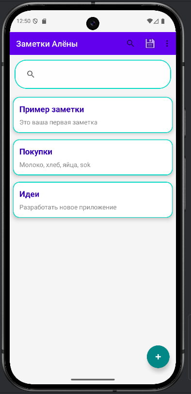
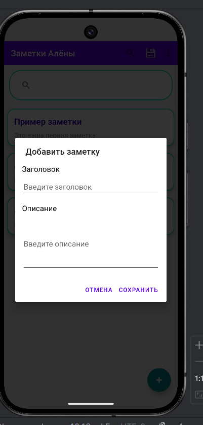
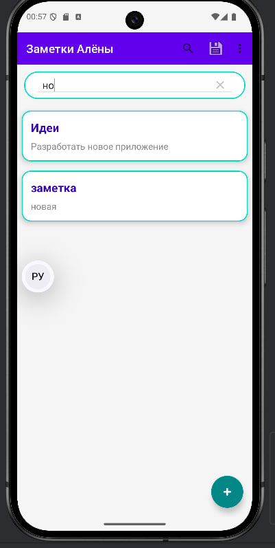
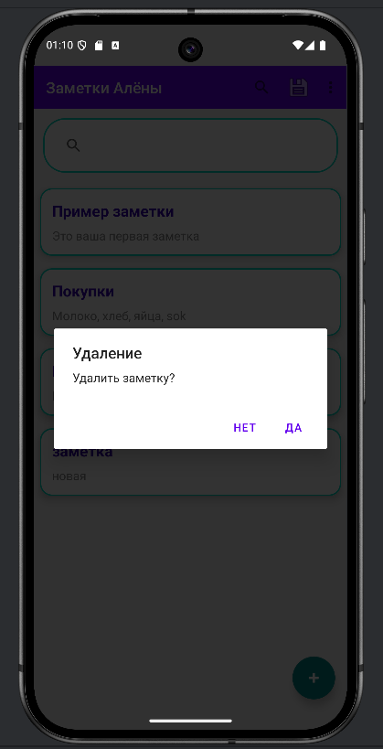

# NotesApp
Приложение для заметок на Android (Java)

## Основные функции
- Добавление, редактирование и удаление заметок
- Поиск по заголовку и описанию
- Автоматическое сохранение в файл (данные не теряются)
- Красивые карточки (MaterialCardView с закруглениями и тенями)
- Полноэкранный просмотр и редактирование

## Технологии
- Java
- RecyclerView + CardView
- SearchView
- Material Design
- Сериализация данных в файл

## Скриншоты

## Как запустить
1. Откройте проект в Android Studio
2. Запустите на эмуляторе или устройстве

Разработано в рамках лабораторной работы №16.